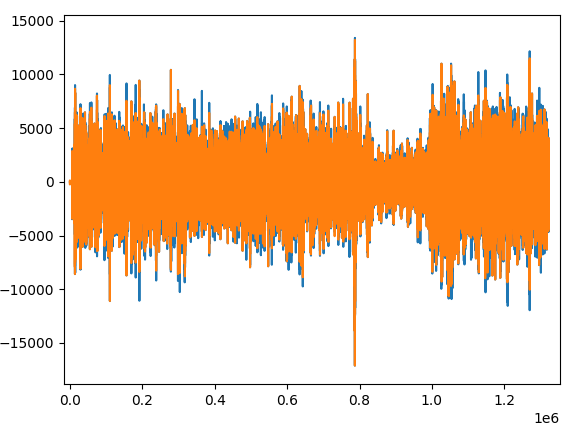

# Audio-Encryption

## Overview

This project provides a simple way to encrypt and decrypt audio files using the AES algorithm. There are two core algorithms used in this project: one that focuses on splitting the audio file into chunks and shuffling them, and another that firstly uses the Fourier Transform to conver the audio file, splits it into chunks, and then shuffles them. The latter algorithm is more secure, but the former is faster. One can choose to increase the number of chunks in the latter algorithm to increase security, but this will also increase the time and loss of quality of the audio file.



> Legend: The blue graph represents the original audio file, the orange graph represents the encrypted audio file using DFT.

## Table of contents

- [Overview](#overview)
- [Table of contents](#table-of-contents)
- [Features](#features)
- [Usage](#usage)
- [Code Examples](#code-examples)

## Features

* Encrypts and decrypts audio files using the AES algorithm
* Uses the Fourier Transform to convert the audio file into the frequency domain, splits it into chunks, and shuffles them
* Padding is used to ensure that the audio file is divisible by the number of chunks

## Usage

1. To use this project, you must first install the dependencies. This can be done by running the following command:
    ```bash
    make install
    ```

2. To encrypt an audio file, run the following command:
    ```python
    python main.py -c <input_file>
    ```
    > Note: The '-c' flag is used to check Nyquist Theorem. To avoid loss of information during sampling and reconstruction, the sampling rate must be at least twice the highest frequency present in the signal. If the Nyquist Theorem is not satisfied, the loss of information will be too great and the audio file will be unrecognizable.
    ```python
    python main.py -enc|-d <input_file> <output_file> <key_file>
    ```
    > Note: The '-enc' flag is used to encrypt the audio file, and the '-d' flag is used to decrypt the audio file using the Fourier Transformation.
    ```python
    python main.py -encN|-dN <input_file> <output_file> <key_file>
    ```
    > Note: The '-encN' flag is used to encrypt the audio file, and the '-dN' flag is used to decrypt the audio file, solely focusing on shuffling the domain. This is faster, but less secure.

## Code Examples

We get the nyquist_rate by dividing the sample_rate by 2. Then we convert the signal into the frequency domain using the Discrete Fourier Transformation (DFT) for sampling frequencies, and then we get the maximum frequency by getting the maximum absolute value of the signal.

```python
nyquist_rate = sample_rate / 2

signal = signal.astype(numpy.float64)
signal = numpy.fft.fftfreq(len(signal), 1/sample_rate)
max_freq = numpy.max(numpy.abs(signal))
```

Firstly convert the audio file into the frequency domain using the Fourier Transform. Then split the spectrum into chunks and shuffle them. Then concatenate the spectrum and get the inverse Fourier Transform of the spectrum. Finally, we get the real part of the decrypted spectrum and convert it back into an audio file.

```python
spectrum = numpy.fft.fft(audio_data)

# Split the spectrum and shufflling the chunks
...

# Concatenate the spectrum
spectrum_arranged = numpy.concatenate(arranged_sub_band)

# Get the inverse Fourier Transform of the spectrum
decrypted_spectrum = numpy.fft.ifft(spectrum_arranged)

# Get the real part of the decrypted spectrum
dec_audio_data = numpy.real(decrypted_spectrum)

...

dec_audio_data = dec_audio_data.astype(numpy.int16)
```